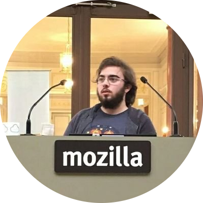
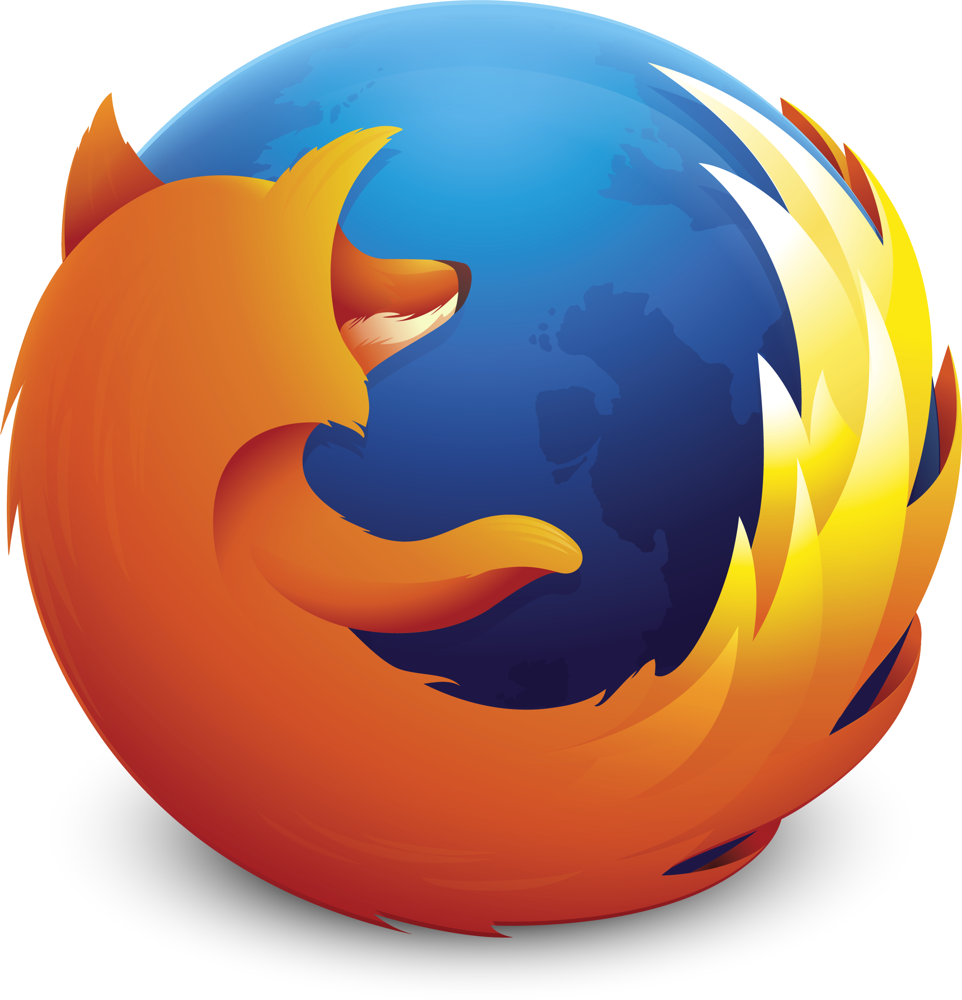
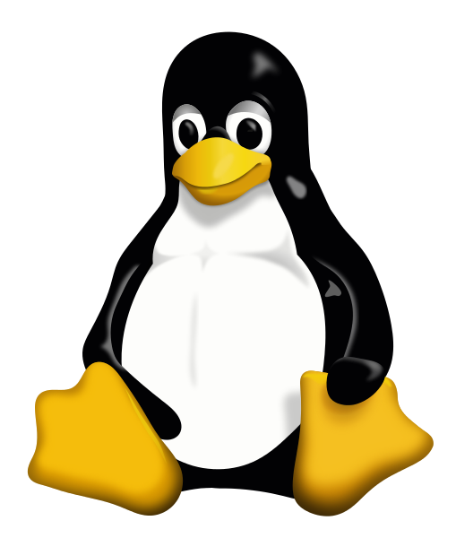
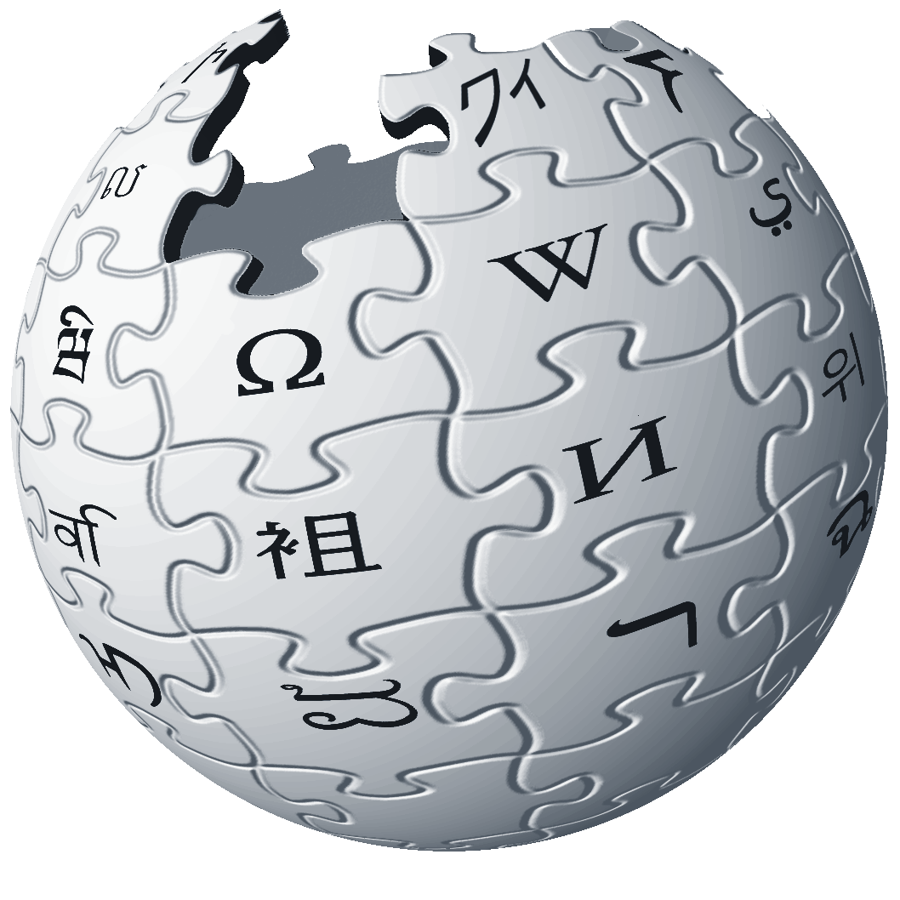
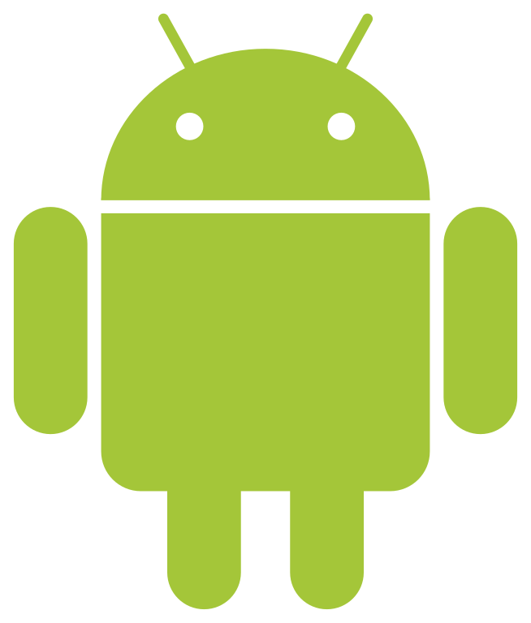
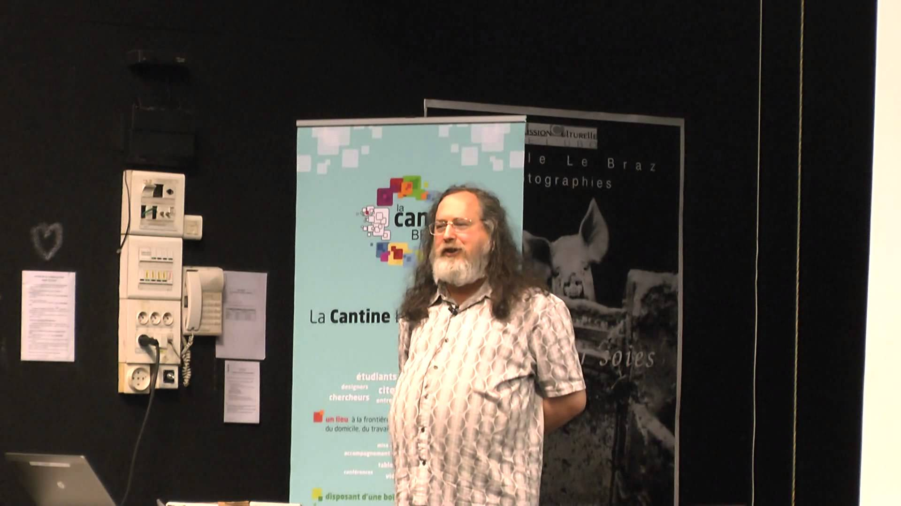
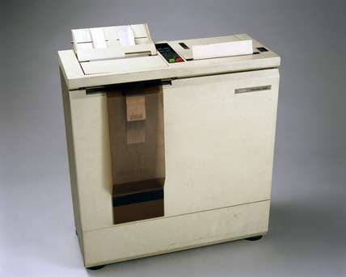
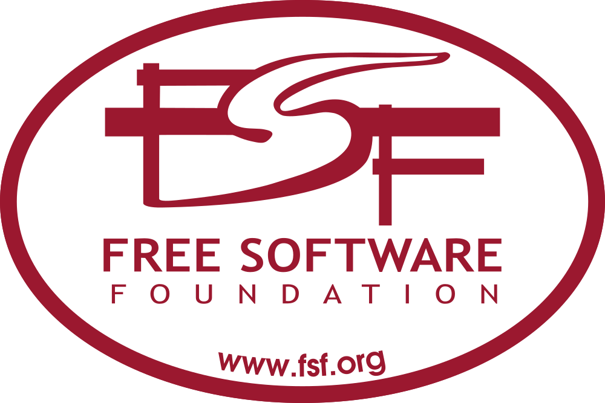

## Introduction au libre

## Me

<!-- .element: class="plain" width="200px" -->

**Brendan Abolivier** / [@BrenAbolivier](https://twitter.com/BrenAbolivier)

Contributeur @ Cozy, Mumble, Collateral Freedom (RSF)... 
Mainteneur @ SMAM, Welcome Home
<!-- .element: style="font-size:70%" -->

-----------------

## Le libre

C'est quoi, au fait ?

## Libre &ne; open source

## Les 4 libertés

* La liberté de profiter de la ressource dans n'importe quel but
* La liberté d'étudier la ressource et de l'adapter à ses besoins
* La liberter de distribuer la ressource
* La liberter d'améliorer la ressource et de distriber ses modifications

<!-- .element: style="font-size:70%" -->

Note: Ressource = cf slide suivante

### Sous toutes ses formes

Logiciels, images, vidéos...

## Vous en connaissez

<!-- .element: class="plain" width="600px" -->

<!-- .element: class="plain" width="450px" -->
<!-- .element: class="plain" width="450px" -->

<!-- .element: class="plain" width="600px" -->

<!-- .element: class="plain" width="500px" -->

Note: Plus intégralement libre maintenant, mais l'était au départ

<!-- .element: class="plain" width="500px" -->

### Et plein d'autres

Notepad++, Apache, GCC, outils de big data, SteamOS, Visual Studio Code...

-----------------

## Les origines

* Né au début des années 80
* Inspiré de la *culture hacker*

## La culture hacker

0. L’accès aux ordinateurs doit être universel (pour tous) et sans restrictions.
0. Toute information doit être libre.
0. Se méfier de l’autorité – promouvoir la décentralisation.
0. Les hackers doivent être jugés sur leurs activités (leurs hacks) et non suivant des critères « bidons ».
0. On peut créer l’art et le beau à l’aide d’un ordinateur.
0. Les ordinateurs peuvent améliorer notre vie.

<!-- .element: style="font-size:70%" -->

Note:
Steven Levy, Hackers. Heroes of the Computer Revolution (première trace écrite de cette culture, ~1980)

Repris par Christophe Masutti dans Histoires et cultures du Libre

0. L’accès aux ordinateurs – ainsi que tout ce qui peut permettre de comprendre comment le monde fonctionne – doit être universel (pour tous) et sans restrictions.
0. Toute information doit être libre.
0. Se méfier de l’autorité – promouvoir la décentralisation.
0. Les hackers doivent être jugés sur leurs activités (leurs hacks) et non suivant des critères « bidons » comme le diplôme, l’âge, l’origine ethnique ou le rang social.
0. On peut créer l’art et le beau à l’aide d’un ordinateur.
0. Les ordinateurs peuvent améliorer notre vie.

### Richard Matthew Stallman

<!-- .element: width="700px" -->

[*aka* St Ignucius](http://media.leschatscosmiques.net/medias/conferences/rms-20-ans-apres/article/rms-ignucius)

Note: Conférence du 12/05/2015 à Brest (UBO, fac de lettres, Segalen)

### Une histoire d'imprimante

### La Free Software Foundation

<!-- .element: class="plain" width="500px" -->

-----------------

## Bibliographie

* **Richard Stallman et la révolution du logiciel libre** par *R. M. Stallman*, *S. Williams*, *C. Masutti*
* **Histoires et cultures du Libre** par *Camille Paloque-Berges*, *Christophe Masutti*
* **Logiciels et objets libres** par *Stéphane Ribas*, *Patrick Guillaud*, *Stéphane Ubeda*

<!-- .element: style="font-size:70%" -->
